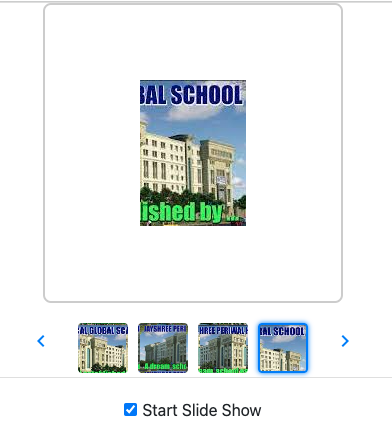

# Angular 17 example project: CRUD with Rest API

Build an Angular 17 example App to display the following catalog viewer application.

The application has 2 components:

    Viewer Component - Displays the selected product in a large size.
    Thumbs Component - Presents a full list of product thumbnails. The list of images is passed to the Thumbs component as the component input.

Application Functionalities

    Initially, the catalog displays the first image in the Viewer.
    Clicking on the previous or next button displays the previous or next image respectively. The thumbnail list is circular:
        Clicking the next button when the last image is showing should display the first image.
        Clicking the previous button when the first image is showing should display the last image.
    Clicking on any thumbnail loads the appropriate image in the Viewer.
    The checkbox with the label "Start Slide Show" has the following features:
        When checked, it starts the automatic display of images in the Viewer, beginning with the currently displayed image and cycling to the next every 3 seconds.
        When unchecked, it stops the automatic cycling of images.
        During cycling, the user can interact as before (click any thumbnail or the next/previous buttons), after which cycling continues from that image.

Data Attributes Required for Tests

The following data-test-id attributes are required in the component for the tests to pass:

    The Viewer component should have the data-test-id attribute "catalog-view".
    The Previous button should have the data-test-id attribute "prev-slide-btn".
    The Next button should have the data-test-id attribute "next-slide-btn".
    The Thumbnail buttons should have the data-test-id attributes "thumb-button-0", "thumb-button-1", "thumb-button-2", and "thumb-button-3".
    The "Start Slide Show" checkbox should have the data-test-id attribute "toggle-slide-show-button".
